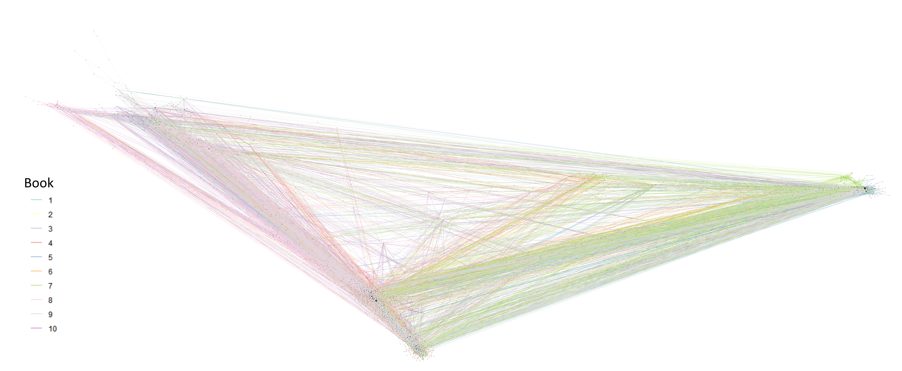

Abstract
========

Note: All bolded words are hyperlinks.

In this project, I attempt to find the climaxes of the series [**Malazan
Book of the
Fallen**](https://en.wikipedia.org/wiki/Malazan_Book_of_the_Fallen) by
using network data and sentiment analysis. This series is notable in
that it is one of the most complex and long fantasy series with a
continuous single plot-line. There are 3,252,031 words in the series and
I estimated that there are at least 1,316 characters in the series with
approximately 457 unique points of view. Additionally, many of the
characters have multiple aliases and nicknames adding another layer of
complexity. A character might go by completely different names in
different novels.

I began by mining the co-occurrence data from the ngrams; I used a
combination of regular expressions, parallelization, and more. I'll
elaborate more on that process later. From there, I had to get the
co-occurrence data into a reasonable format and clean the name data. I
then used the AFINN Lexicon to get the sentiment data. Finally, I
compared the sentiment data with the network data to try to see which
works better to determine the climax of each of the 10 books.

The AFINN Lexicon contains 2,476 words with negativity and positivity
scores between -5 and 5.

Introduction
============

The goal of this study was to use network and sentiment analysis to find
the climax of each book in the series. I used numerous datasets from
several sources in this project. The co-occurrence data was mined from
the books by me. The books were converted from `.epub` format to `.txt`
format. I made most of the `alias` data manually and crowd-sourced some
of the aliases on
[**Reddit**](https://www.reddit.com/r/Malazan/comments/alaknz/spoilers_what_are_aliases_are_there_in_this_series/).
The `name` data was manually extracted from the *Dramatis Personae*
sections at the start of each book and manually extracted from the
[**Malazan Wiki**](https://malazan.fandom.com/wiki/Category:Males).

To mine the character co-occurrence data, I started by converting `epub`
versions of the novels to `.txt` files and reading them into R. Then I
added book numbers, chapter numbers, and stripped the front and back
matter from each book. From there, I turned the text into a series of
ngrams of length 20 split by book and chapter. At this point, I wrote a
function that extracts the characters' names from the ngrams by row and
then puts the co-occurrence data into a workable format. Cleaning and
formatting the co-occurrence data was the next step. Finally, I used a
variety of methods to find the climaxes of each book.

Method and results
==================

Method
------

I'll begin this section with a detailed description of the methods and
assumptions I used in mining the character names from the novels as that
was the most difficult part of the project.

I began by joining the character name data with the alias data into a
single dataset. I then split all of this data by spaces in order to get
variations of the names and rejoined the partial name data back to the
full name data to get a comprehensive dataset of full and partial names.
I then filtered out stop words, formal titles, military ranks, and
commonly capitalized words that aren't names from this list. Then, I
arranged the list by character length.

At this point, I went back to the book data and turned the text into
ngrams of length 20 by book and chapter. I chose to use ngrams so that I
would get the full co-occurrence relations within the 20 word groups.
For example, "Ron Jon" then "Ron Jon Bob" and finally "Jon Bob". Then I
wrote a function that tries to extract every name in the name list from
the ngram. If there is a match, then it also removes the match from the
string for subsequent iterations. Otherwise, "Brys Beddict" would be
extracted 3 times.

Some of the code for this process will be shown in the appendix.

This method of extraction was incredibly computationally intensive as
there were 3,080 names in my name list and 3,250,530 ngrams. My code
went through multiple iterations, and I eventually added parallelization
and broke my data into 263 chunks. All of this managed to get my code to
run in around 40 hours on my laptop. The original speed was about 310
seconds per 1600 ngrams, and I reduced that to approximately 70 seconds
per 1600. These speeds are what I recall. Initially, I did not think to
record them. Most of the improvement was due to the parallelization and
an `if` statement before the `str_extract_all` call. I attached the code
for this part in the appendix.

Once the co-occurrence data was in a usable format, I had a significant
amount of data cleaning to do. Much of the data cleaning was due to the
fact that there were partial name matches due to the use of ngrams "John
Smith" matched as "John", and due to the fact that some characters have
up to 9 different names. My job was made easier by the fact that less
important characters tend to have fewer names in the series, such as
Mallet, Picker, or Antsy whose surnames are never revealed. I formatted
and removed variations of all names with over 100 appearances in the
network data. I used over 130 regular expressions to achieve this. I
made three assumptions at this stage:

Note, when I use the word "importance" I am generally talking about
something with a high centrality measure.

-   The names with over 100 occurrences in the co-occurrence data, in
    addition to the uncleaned names of the less featured characters are
    sufficient to fully represent the true co-occurrence network.
-   The most common variations of names accurately represent the
    co-occurrence relationships of their specific character.
-   Any extremely uncommon name variations will be filtered out as
    isolated nodes or removed by a small filter on a centrality measure.

After cleaning the data, I began to analyze the co-occurrence data.

Results
-------

I'll jump right into it by giving the top 10 most important characters
using PageRank compared with their degree centrality importance. I only
used un-directed network graphs for everything that follows.

<table>
<thead>
<tr class="header">
<th align="left">Character</th>
<th align="right">Ranking - Degree Centrality</th>
<th align="right">Ranking - PageRank</th>
</tr>
</thead>
<tbody>
<tr class="odd">
<td align="left">Tavore Paran</td>
<td align="right">1</td>
<td align="right">1</td>
</tr>
<tr class="even">
<td align="left">Ben Adaephon Delat</td>
<td align="right">2</td>
<td align="right">2</td>
</tr>
<tr class="odd">
<td align="left">Hood</td>
<td align="right">5</td>
<td align="right">3</td>
</tr>
<tr class="even">
<td align="left">Ganoes Stabro Paran</td>
<td align="right">4</td>
<td align="right">4</td>
</tr>
<tr class="odd">
<td align="left">Fiddler</td>
<td align="right">3</td>
<td align="right">5</td>
</tr>
<tr class="even">
<td align="left">Kalam Mekhar</td>
<td align="right">6</td>
<td align="right">6</td>
</tr>
<tr class="odd">
<td align="left">Whiskeyjack</td>
<td align="right">8</td>
<td align="right">7</td>
</tr>
<tr class="even">
<td align="left">Rhulad Sengar</td>
<td align="right">10</td>
<td align="right">8</td>
</tr>
<tr class="odd">
<td align="left">Gesler</td>
<td align="right">7</td>
<td align="right">9</td>
</tr>
<tr class="even">
<td align="left">Anomander Rake</td>
<td align="right">14</td>
<td align="right">10</td>
</tr>
</tbody>
</table>

Degree centrality and PageRank mostly agree on the most important
characters in the series, but they start to greatly diverge the further
they get away from the top 10. As shown in the figure to the right.

In the following network graph, I used PageRank to calculate the
centrality because I don't feel that degree centrality is as suitable
for this network.

The only interesting observation I can make from this graph is that
there is a distinction between the two main continents from the 4 first
books in the series and the third main continent introduced in book 5.
Also, these groups become more connected in books 7, 8, 9, and 10.

Before I begin trying to find the best way to indicate the climaxes in
the series, I'll check if a chapter's sentiment score is correlated with
importance. I initially thought that either of them could be used to
predict climaxes on their own and that they may be correlated. The
importance of the chapters was calculated by taking the mean of the edge
betweenness centrality values of all of the edges in each chapter.

Since nearly every chapter in this book has a negative sentiment score,
we will use negative values as an indicator of importance.

Edge betweenness centrality looks at the shortest paths through the
network that go through each edge, and assigns each edge a value based
on how much each edge "connects" the entire network. Removing an edge
with high edge betweenness centrality will greatly impact the entire
network.

It appears that there is little to no correlation between a chapter's
mean sentiment and mean edge betweenness centrality.

Now, I'm going to see if the mean edge betweenness centrality weighted
with the total sentiment score of each chapter will find the major
climaxes of each book. Note, the most common emotions weren't used to
calculate sentiment scores or to find any of the climaxes.

<table>
<thead>
<tr class="header">
<th align="right">Book</th>
<th align="right">Chapter</th>
<th align="right">Mean importance</th>
<th align="right">Sentiment score</th>
<th align="right">Weighted importance</th>
<th align="left">Most common emotion</th>
</tr>
</thead>
<tbody>
<tr class="odd">
<td align="right">1</td>
<td align="right">2</td>
<td align="right">47.09545</td>
<td align="right">-319</td>
<td align="right">-15023.45</td>
<td align="left">Fear</td>
</tr>
<tr class="even">
<td align="right">2</td>
<td align="right">7</td>
<td align="right">47.20600</td>
<td align="right">-382</td>
<td align="right">-18032.69</td>
<td align="left">Fear</td>
</tr>
<tr class="odd">
<td align="right">3</td>
<td align="right">17</td>
<td align="right">36.49187</td>
<td align="right">-679</td>
<td align="right">-24777.98</td>
<td align="left">Fear</td>
</tr>
<tr class="even">
<td align="right">4</td>
<td align="right">2</td>
<td align="right">48.44484</td>
<td align="right">-779</td>
<td align="right">-37738.53</td>
<td align="left">Fear</td>
</tr>
<tr class="odd">
<td align="right">5</td>
<td align="right">25</td>
<td align="right">43.26630</td>
<td align="right">-762</td>
<td align="right">-32968.92</td>
<td align="left">Fear</td>
</tr>
<tr class="even">
<td align="right">6</td>
<td align="right">7</td>
<td align="right">22.69460</td>
<td align="right">-1378</td>
<td align="right">-31273.16</td>
<td align="left">Fear</td>
</tr>
<tr class="odd">
<td align="right">7</td>
<td align="right">9</td>
<td align="right">69.81427</td>
<td align="right">-597</td>
<td align="right">-41679.12</td>
<td align="left">Fear</td>
</tr>
<tr class="even">
<td align="right">8</td>
<td align="right">22</td>
<td align="right">141.07185</td>
<td align="right">-689</td>
<td align="right">-97198.50</td>
<td align="left">Fear</td>
</tr>
<tr class="odd">
<td align="right">9</td>
<td align="right">15</td>
<td align="right">139.05500</td>
<td align="right">-898</td>
<td align="right">-124871.39</td>
<td align="left">Fear</td>
</tr>
<tr class="even">
<td align="right">10</td>
<td align="right">23</td>
<td align="right">46.94171</td>
<td align="right">-1246</td>
<td align="right">-58489.38</td>
<td align="left">Fear</td>
</tr>
</tbody>
</table>

While all of these chapters may be considered climaxes, I would say that
only main climaxes are for books 5, 8, and 10. The interpretation of the
"weighted importance" value, could be that these are the chapters with
the largest negative impact on the series as a whole because many
important characters are present and the chapters are very negative. If
you read the series as a whole, this sounds quite plausible with the
only exception being book 10, chapter 23.

Lets look at only the mean edge betweenness centrality on its own.

<table>
<thead>
<tr class="header">
<th align="right">Book</th>
<th align="right">Chapter</th>
<th align="right">Mean Importance</th>
<th align="left">Most common Emotion</th>
</tr>
</thead>
<tbody>
<tr class="odd">
<td align="right">1</td>
<td align="right">6</td>
<td align="right">163.52415</td>
<td align="left">Trust</td>
</tr>
<tr class="even">
<td align="right">2</td>
<td align="right">1</td>
<td align="right">90.71905</td>
<td align="left">Fear</td>
</tr>
<tr class="odd">
<td align="right">3</td>
<td align="right">8</td>
<td align="right">58.17383</td>
<td align="left">Trust</td>
</tr>
<tr class="even">
<td align="right">4</td>
<td align="right">5</td>
<td align="right">115.19523</td>
<td align="left">Trust</td>
</tr>
<tr class="odd">
<td align="right">5</td>
<td align="right">22</td>
<td align="right">77.69165</td>
<td align="left">Fear</td>
</tr>
<tr class="even">
<td align="right">6</td>
<td align="right">13</td>
<td align="right">56.99112</td>
<td align="left">Fear</td>
</tr>
<tr class="odd">
<td align="right">7</td>
<td align="right">7</td>
<td align="right">76.33896</td>
<td align="left">Fear</td>
</tr>
<tr class="even">
<td align="right">8</td>
<td align="right">22</td>
<td align="right">141.07185</td>
<td align="left">Fear</td>
</tr>
<tr class="odd">
<td align="right">9</td>
<td align="right">13</td>
<td align="right">204.90669</td>
<td align="left">Fear</td>
</tr>
<tr class="even">
<td align="right">10</td>
<td align="right">12</td>
<td align="right">130.86665</td>
<td align="left">Fear</td>
</tr>
</tbody>
</table>

Chapter summaries can be found here:

<ul>
<li>
Book 1:
<a href="https://malazan.fandom.com/wiki/Gardens_of_the_Moon/Dramatis_Personae"><strong>Gardens
of the Moon</strong></a>
</li>
<li>
Book 2:
<a href="https://malazan.fandom.com/wiki/Deadhouse_Gates/Dramatis_Personae"><strong>Deadhouse
Gates</strong></a>
</li>
<li>
Book 3:
<a href="https://malazan.fandom.com/wiki/Memories_of_Ice/Dramatis_Personae"><strong>Memories
of Ice</strong></a>
</li>
<li>
Book 4:
<a href="https://malazan.fandom.com/wiki/House_of_Chains/Dramatis_Personae"><strong>House
of Chains</strong></a>
</li>
<li>
Book 5:
<a href="https://malazan.fandom.com/wiki/Midnight_Tides/Dramatis_Personae"><strong>Midnight
Tides</strong></a>
</li>
<li>
Book 6:
<a href="https://malazan.fandom.com/wiki/The_Bonehunters/Dramatis_Personae"><strong>The
Bonehunters</strong></a>
</li>
<li>
Book 7:
<a href="https://malazan.fandom.com/wiki/Reaper%27s_Gale/Dramatis_Personae"><strong>Reaper's
Gale</strong></a>
</li>
<li>
Book 8:
<a href="https://malazan.fandom.com/wiki/Toll_the_Hounds/Dramatis_Personae"><strong>Toll
the Hounds</strong></a>
</li>
<li>
Book 9:
<a href="https://malazan.fandom.com/wiki/Dust_of_Dreams/Dramatis_Personae"><strong>Dust
of Dreams</strong></a>
</li>
<li>
Book 10:
<a href="https://malazan.fandom.com/wiki/The_Crippled_God/Dramatis_Personae"><strong>The
Crippled God</strong></a>
</li>
</ul>

The only main climax here is for Book 8, but the chapters for books 5
and 8 could be considered sub-climaxes. So just plain edge betweenness
centrality doesn't quite work for finding the climaxes of each book.
Book 2, chapter 1 just has a lot of dialogue between important
characters, but I don't think it can be considered a climax of any
degree. These are the chapters that have the highest mean edge
centrality, meaning that the average edge has the highest edge
betweenness centrality.

What about only using sentiment scores?

<table>
<thead>
<tr class="header">
<th align="right">Book</th>
<th align="right">Chapter</th>
<th align="right">Sentiment score</th>
<th align="left">Most common emotion</th>
</tr>
</thead>
<tbody>
<tr class="odd">
<td align="right">1</td>
<td align="right">4</td>
<td align="right">-371</td>
<td align="left">Fear</td>
</tr>
<tr class="even">
<td align="right">2</td>
<td align="right">6</td>
<td align="right">-495</td>
<td align="left">Fear</td>
</tr>
<tr class="odd">
<td align="right">3</td>
<td align="right">25</td>
<td align="right">-860</td>
<td align="left">Fear</td>
</tr>
<tr class="even">
<td align="right">4</td>
<td align="right">2</td>
<td align="right">-779</td>
<td align="left">Fear</td>
</tr>
<tr class="odd">
<td align="right">5</td>
<td align="right">25</td>
<td align="right">-762</td>
<td align="left">Fear</td>
</tr>
<tr class="even">
<td align="right">6</td>
<td align="right">7</td>
<td align="right">-1378</td>
<td align="left">Fear</td>
</tr>
<tr class="odd">
<td align="right">7</td>
<td align="right">24</td>
<td align="right">-1034</td>
<td align="left">Fear</td>
</tr>
<tr class="even">
<td align="right">8</td>
<td align="right">24</td>
<td align="right">-710</td>
<td align="left">Fear</td>
</tr>
<tr class="odd">
<td align="right">9</td>
<td align="right">15</td>
<td align="right">-898</td>
<td align="left">Fear</td>
</tr>
<tr class="even">
<td align="right">10</td>
<td align="right">24</td>
<td align="right">-1383</td>
<td align="left">Fear</td>
</tr>
</tbody>
</table>

Well this appears to be the best metric by far for finding climaxes. A
conclusion that can easily be drawn from this is that the most negative
part of each book tends to be the climax of the book in this series and
the most frequently occurring emotion in these chapters is "Fear". Some
of these chapters have major battles, revolutions, and a couple horribly
morbid chapters. Books 3, 5, 7, 8, and 10 all have what I believe are
the main climaxes in their respective books, and Books 2, 4, 6, and 15
are all sub-climaxes.

Emotions in the NRC Lexicon:- Fear- Trust- Sadness- Anger- Anticipation
- Joy- Disgust- Surprise

While simple positive and negative sentiment scores are the best metrics
for finding the climax of each book, all of these methods pick out some
very interesting chapters.

Appendices
==========

Co-occurrence extraction
------------------------

In this section, I'll include some snippets of the code that I used to
extract the co-occurrence data from the books.

The books were in this format, in a single data.frame, after being
loaded into R and doing some pre-processing:

The book pre-processing code can be found here:
<a href="https://github.com/visuelledata/malazannetwork/blob/master/R/import_books.R" class="uri">https://github.com/visuelledata/malazannetwork/blob/master/R/import\_books.R</a>

------------------------------------------------------------------------

    #> # A tibble: 7 x 3
    #>   line                                                        book chapter
    #>   <chr>                                                      <dbl>   <int>
    #> 1 PROLOGUE                                                       1       0
    #> 2 1154th Year of Burn’s Sleep 96th Year of the Malazan Empi~     1       0
    #> 3 I                                                              1       0
    #> 4 THE STAINS OF RUST SEEMED TO MAP BLOOD SEAS ON THE BLACK,~     1       0
    #> 5 The winds were contrary the day columns of smoke rose ove~     1       0
    #> 6 Ganoes Stabro Paran of the House of Paran stood on tiptoe~     1       0
    #> 7 For Ganoes, the ancient fortification overlooking the cit~     1       0

------------------------------------------------------------------------

Starting with data in the ngram format below.

------------------------------------------------------------------------

    #> # A tibble: 10 x 3
    #> # Groups:   book, chapter [1]
    #>     book chapter ngram                                                    
    #>    <dbl>   <int> <chr>                                                    
    #>  1     1       0 PROLOGUE 1154th Year of Burn’s Sleep 96th Year of the Ma~
    #>  2     1       0 1154th Year of Burn’s Sleep 96th Year of the Malazan Emp~
    #>  3     1       0 Year of Burn’s Sleep 96th Year of the Malazan Empire The~
    #>  4     1       0 of Burn’s Sleep 96th Year of the Malazan Empire The Last~
    #>  5     1       0 Burn’s Sleep 96th Year of the Malazan Empire The Last Ye~
    #>  6     1       0 Sleep 96th Year of the Malazan Empire The Last Year of A~
    #>  7     1       0 96th Year of the Malazan Empire The Last Year of Ammanas~
    #>  8     1       0 Year of the Malazan Empire The Last Year of Ammanas’s Re~
    #>  9     1       0 of the Malazan Empire The Last Year of Ammanas’s Reign I~
    #> 10     1       0 the Malazan Empire The Last Year of Ammanas’s Reign I TH~

I then broke the ngram data into 10 separate lists, 1 for each book,
each list contained a separate data frame for each chapter. I'll leave
this output out as it will be too long.

Below is the main function I used to extract the co-occurrence data:

------------------------------------------------------------------------

    library(future.apply)

    process_data <- function(datastuff, book_num, chap_num){
      tictoc::tic() # For execution time
      plan(multiprocess, workers = 4) # To set parallelization parameters
      
      # Pulls out the co-occurrence data
      placeholder <- datastuff %>%
        future_apply(1, function(x){ # future_apply applies the map function to each row 
                          map_chr(all_names, # map_chr plugs each name into the below func
                            function(pat){
                              name <- str_extract(x, pattern = fixed(pat)) # Finds the name
                              #The line below removes any matches from the string
                              if(!is.na(name)) x <<- str_remove(x, pattern = fixed(pat)) 
                              name # So the function returns the co-occurrence data
                             }
                            )
                          },
                     future.seed = TRUE) # Outputs a matrix
      
      # Formats the data into a "tidy" format and does some basic cleaning
      placeholder %>% 
        t() %>% # Transposes matrix
        as.tibble() %>% # Converts it to a data frame
        unite("names", V1:V3080, sep = ";") %>% # Makes all 3,080 columns into a single one
        remove_NAs() %>% # Removes all of the NAs that were generated, leaves only names
        mutate(book = book_num, # Adds book and chapter data
               chapter = chap_num) %>%  
        write_rds(paste0("data/network_data/network_data", # Writes a file for each chapter
                         book_num, "-", chap_num,   
                         ".rds"), 
                  compress = "none")
      
      tictoc::toc() # Gets execution time
      return(NULL)
    }

The `process_data()` function is then ran in 10 different for loops, one
per book, that iterate over the chapters to write `rds` files containing
all of the co-occurrence data. One for loop is shown below.

------------------------------------------------------------------------

    for (i in seq_along(book1)){
      process_data(book1[[i]], book_num = 1, chap_num = i) 
    }

------------------------------------------------------------------------

Bibliography
------------

-   Erikson, S. (1999). Gardens of the Moon. London: Bantam.

-   Erikson, S. (2000). Deadhouse Gates. London: Bantam.

-   Erikson, S. (2001). Memories of Ice. London: Bantam.

-   Erikson, S. (2002). House of Chains. London: Bantam.

-   Erikson, S. (2004). Midnight Tides. London: Bantam.

-   Erikson, S. (2006). The Bonehunters. London: Bantam.

-   Erikson, S. (2007). Reaper's Gale. London: Bantam.

-   Erikson, S. (2008). Toll the Hounds. London: Bantam.

-   Erikson, S. (2009). Dust of Dreams. London: Bantam.

-   Erikson, S. (2011). The Crippled God. London: Bantam.

-   Nielsen, Ã…. (2011, March). AFINN Sentiment Lexicon. Retrieved from
    <http://www2.imm.dtu.dk/pubdb/views/publication_details.php?id=6010>

-   Mohammad, S., & Turney, P. (n.d.). NRC Emotion Lexicon. Retrieved
    from <https://saifmohammad.com/WebPages/NRC-Emotion-Lexicon.htm>

-   Malazan Wiki. (n.d.). Retrieved from
    <https://malazan.fandom.com/wiki/Malazan_Wiki>

-   R/Malazan - Main series character POV data. Data from
    <https://www.reddit.com/r/Malazan/comments/a1ukxk/main_series_character_pov_data/>

-   R/Malazan - Malazan alias data. Data created by me. Some aliases
    crowd-sourced from
    <https://www.reddit.com/r/Malazan/comments/alaknz/spoilers_what_are_aliases_are_there_in_this_series/>
