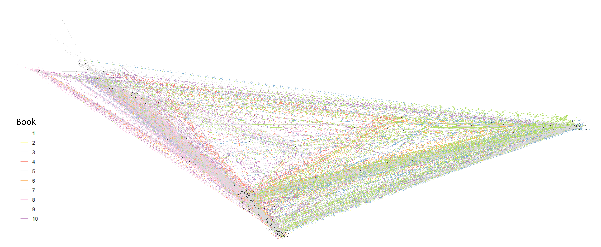

```{r setup, include=TRUE, echo=FALSE, cache=FALSE, message=FALSE, warning=FALSE}
knitr::opts_chunk$set(
  collapse = TRUE,
  echo = FALSE,
  warning = FALSE, 
  #out.width = '75%',
  #out.height = '75%', 
  comment = "#>", 
  #fig.keep = "last", 
  dpi = 600, 
  warning = FALSE, 
  message = FALSE, 
  dev = 'jpeg', 
  cache = TRUE)


# All packages available on CRAN
library(tidyverse)
library(ggraph)
library(tidygraph)
library(tidytext)
library(readr)

# Read in data
network_data <- read_rds("data/network_data.rds")
pre_network_data <- read_rds("data/pre_network_data.rds")
pov_data <- read_rds("data/pov-data.rds")
#network_data <- read_rds("data/network_data.rds")
source("R/import_books.R")
source("R/import_characters.R")
source("R/standardize_names.R")

#theme_set(theme_ipsum())

#source("gghelpers.R")

#ggplot <- function(...) ggplot2::ggplot(...) + scale_colour_manual(values = color) + #theme(plot.title = element_text(size = 11.5))
```

```{r numbers}
# characters %>% 
#   rename(names = name) %>% 
#   remove_NAs() %>% 
#   #standardize_names_net() %>% 
#   distinct(names) 

# pre_network_data %>% mutate(names = str_split(names, ";")) %>% unnest() %>% 
#   distinct(names) 

num_char <- function(){
  num_char_low <- as_tbl_graph(network_data) %>% 
    activate(nodes) %>%
    mutate(popularity = centrality_degree()) %>% 
    filter(popularity != 0) %>% 
    activate(nodes) %>% 
    pull(name) %>% 
    length() %>% 
    formatC(format="d", big.mark=",")
  
  num_char_high <- as_tbl_graph(network_data) %>% 
    activate(nodes) %>% 
    pull(name) %>% 
    length() %>% 
    formatC(format="d", big.mark=",")

  c(num_char_low, num_char_high)
}

num_words <- 
  books %>% 
  filter(!str_detect(line, "^Chapter .+|^CHAPTER .+|^[A-Z]+$|^[A-Z]+\\d{1,2}$")) %>% 
  unnest_tokens(words, line) %>% 
  pull(words) %>% 
  length() %>% 
  formatC(format="d", big.mark=",")


pov_characters <- pov_data %>% 
  distinct(name) %>% 
  mutate(name = str_remove_all(name, "\\(.+\\)"), 
         name = str_trim(name)) %>%
  distinct(name) %>% 
  pull(name)

num_pov <- pov_characters %>% 
  unique() %>% 
  length()
```

```{r include=FALSE, eval=FALSE}
pre_network_data %>% mutate(names = str_split(names, ";")) %>% unnest() %>% 
  distinct(names)
```
# Abstract

In this project, I attempted to visualize the co-occurrence data of characters in the series ["Malazan Book of the Fallen"](https://en.wikipedia.org/wiki/Malazan_Book_of_the_Fallen). This series is notable in that it is one of the most complex and long fantasy series with a continuous single plotline. There are `r num_words` words in the series and somewhere between `r num_char()[[1]]` and `r num_char()[[2]]` characters in the series with `r num_pov` unique points of view. Additionally, many of the characters have multiple aliases and nicknames adding another layer of complexity. A character might go by completely different names in different novels. 

To mine the character co-occurrence data, I started by converting the novels to `.txt` file and reading them into R. Then I added book numbers, chapter numbers, and stripped the front and back matter. From there, I turned the text into a series of ngrams of length 20 split by book and chapter. At this point, I wrote a function that extracts the characters' names from the ngrams by row and then puts the co-occurrence data into a workable format. Cleaning and formatting the co-occurrence data was the next step. Finally, I used a variety of methods to visualize the text and the network data. 

The base network graph was quite convuluted due to the sheer number of characters, so I use a few different methods to make it into a readable graph. 
**ADD CONCLUSIONS**

# Introduction

The goal of this study was to analyze the network data of the Malazan series, and to see if there were any interesting conclusions. I used numerous datasets from several sources in this project. The co-occurrence data was mined from the books by me. The books were converted from `.epub` format to `.txt` format. I made most of the `alias` data manually and crowdsourced some of aliases on [Reddit](https://www.reddit.com/r/Malazan/comments/alaknz/spoilers_what_are_aliases_are_there_in_this_series/). The `name` data was manually extracted from the *Dramatis Personae* sections at the start of each book and manually extracted from the [Malazan Wiki](https://www.reddit.com/r/Malazan/comments/alaknz/spoilers_what_are_aliases_are_there_in_this_series/). 

# Method and results

## Assumption 
* The partial names were shorter in length than the full names. 
## Method
I'll begin this section with a detailed description of the methods and assumptions I used in mining the character names from the novels as that was the most difficult part of the project. 

I began by joining the character name data with the alias data into a single dataset. I then split all of this data by spaces in order to get variations of the names and rejoined the partial name data back to the full name data to get a comprehensive dataset of full and partial names. I then filtered out stop words, formal titles, and commonly capitalized words that aren't names from this list. Then, I arranged the list by character length.

At this point, I went back to the book data and turned the text into ngrams of length 20 by book and chapter. I then wrote a function that tries to extract the first name in the name list from the string and tries with every name in the list for every name and every ngram. This method was incredibly computationally intensive as there were 3,080 names in my name list and 3,250,530 ngrams. I changed my code a bit, added some code for parallelization, and broke my data into 263 chunks; all of this managed to get my code to run in around 40 hours on my laptop. 

Once I got the co-occurrence data into a usable format, I had a lot of data cleaning to do. I formatted and removed variations of all names with over 100 appearances in the network data. I used regular expressions to achieve this. I made two important assumptions at this point: 

* The names with over 100 occurrences in the co-occurrence data are representative of all co-occurrence relationships.  
*  The most common variations of names accurately represent the co-occurrence relationships of their specific character. 
* Any extremely uncommon name variations will be filtered out by 
 
After cleaning the data, I began to analyze the co-occurrence data. 

## Results

I'll start with showing the complete network graph: 

```{r echo=F, results='asis'}
# # Code for full graph
# as_tbl_graph(network_data) %>% 
#   activate(nodes) %>% 
#   mutate(popularity = centrality_degree()) %>% 
#   activate(nodes) %>% 
#   filter(!node_is_isolated()) %>% 
#   ggraph(layout = "nicely") + 
#   geom_edge_link(color = "grey80") + 
#   geom_node_point(aes(size = popularity^2.5), color = "grey20") + 
#   theme_void() + 
#   theme(legend.position="none")
cat('\n\n')
```
```{marginfigure echo=T}
The only interesting observation I can make from this graph is that there is a clear distinction the two main continents from the 4 first books in the series and the third main continent introduced in book 5.
```

Let's look at a graph with only characters who are given points of view in the series. I'll also remove any nodes with under 10 edges.  

```{r echo=F, results='asis'}
as_tbl_graph(network_data) %>%
  mutate(popularity = centrality_degree()) %>%
  activate(nodes) %>%
  filter(name %in% pov_characters,
         popularity >= 10,
         !node_is_isolated()) %>%
  ggraph(layout = "kk") +
  geom_edge_link(color = "grey80") +
  geom_node_point(aes(size = popularity^2.5), color = "grey20") +
  geom_node_text(aes(label = name, #alpha = (name %in% important_labels)),
                 repel = TRUE, segment.size = 1,
                 segment.color = "blue", color = "blue"), size = 8) +
  theme_void() +
  theme(legend.position="none")
cat('\n\n')
```

This is much better and 

# Bibliography
https://www.reddit.com/r/Malazan/comments/a1ukxk/main_series_character_pov_data/

